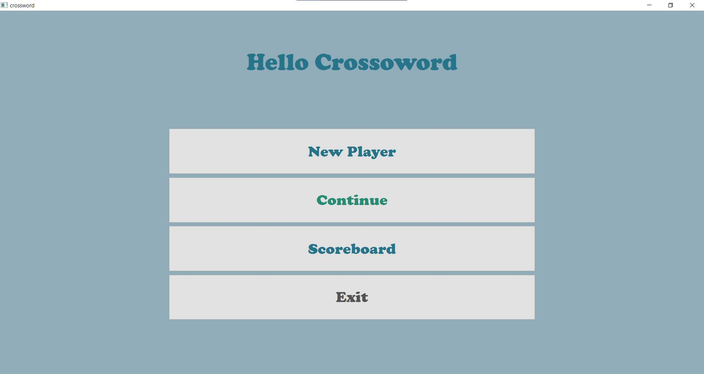
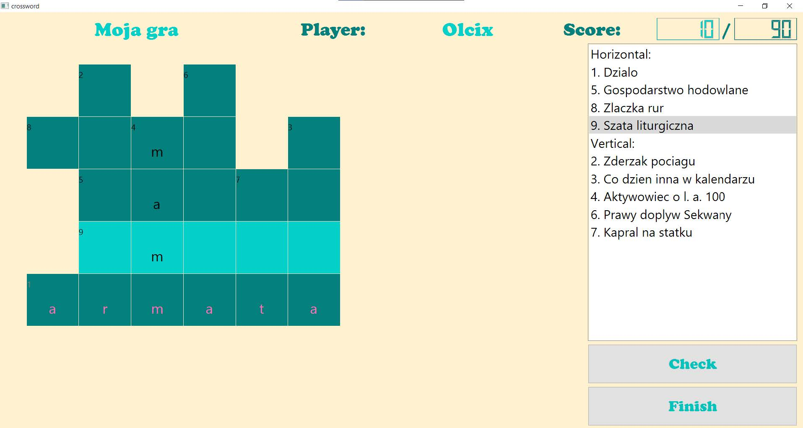
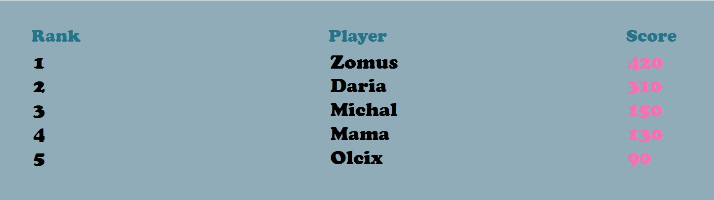
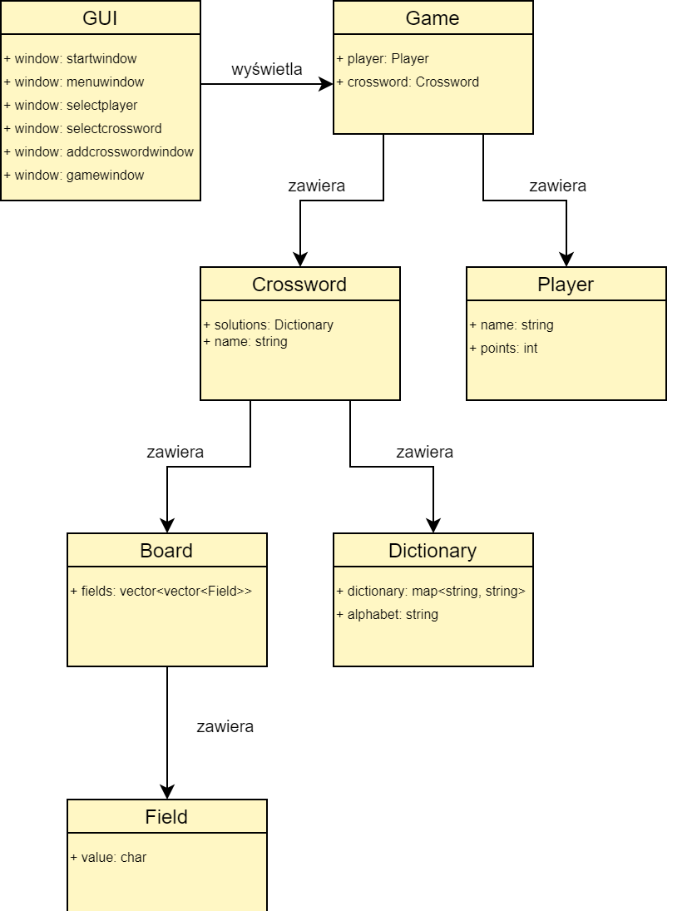

# Crossword Puzzle 
### PW Project PROI  
### Team:
- Majewska Aleksandra
- Komarynska Daria 
- Kindeush Michal

### About game

Crossword - a word-letter puzzle involving guessing or matching passwords and entering them into intersecting rubrics. The aim of the project was to create a program that would generate and play crossword puzzles.

The player receives points for each guessed password. The goal is to get as many of them as possible and reign in the ranking of crosswords.

### Interface 

After startup, the initial menu appears. There is nothing exciting about it. After selecting the Play button, we end up in the main menu, which is as follows:

You can create a new player by selecting New Player, continue previous games by clicking Continue, or view the leaderboard.

**Crossword generation options:** 

- loading a ready crossword from a **csv** file with lines in the format:
question, answer, first letter row, first letter column, orientation in the orientation field, the options are vertically or horizontally
- creating a crossword puzzle from a list of questions and answers read from a file with lines in the format (checkbox **From list of words** is required): question, answer

When choosing the second option, you can use the same file multiple times to generate different crosswords from the same word list.

Once added, the new crossword will appear in the list and can be selected.

### Playing the puzzle

At the top there is the name of the current crossword puzzle, the name of the player and his accumulated points. On the right is a list of questions that need to be answered. For convenience, questions to words that have a horizontal position are listed first, and then a vertical one. When the user selects a question from the list, it is highlighted in green. The player has to provide his answer to the question, enter the next letters in the fields appropriate for a given word. If you enter more letters, only the first letter will be taken into account. When the user wants to validate his answers, he can do so by pressing the Check button in the lower right corner. If the entire password entered is correct, the user will receive 10 points. It will be visible in the upper right corner. In addition, the fields with the guessed password will be blocked (it will not be possible to edit it) and the letters will be highlighted in pink. If the player is satisfied with the game, he can end the game by pressing Finish in the lower right corner. His score will be recorded and added to the total number of points, which the player can admire on the Scoreboard.

### Algorithm of Crossword generation:

- At the beginning, the program selects a random number of passwords from 3 to 15 from the given file to create the crossword puzzle. Then this number of words is also randomly selected.
- Before stacking, all words are sorted: - by letter frequency among all words.
- The first word takes a horizontal position.
- When searching for a common letter for a password, among those already sorted, the following conditions are valid:
  * whether individual predicted fields are empty or
  * is there another common letter in the field,
  * whether the potential position of the word will visually extend another word on the crossword puzzle.
- After checking the conditions for the correct position, the password is placed on a crossword puzzle:
- in the opposite direction to the word with a common letter.

### Starting the program:

- It is obligatory to install Qt 6. If you skip this step, the program will not start, and the user will be informed about it by system messages. If the message still appears after installing Qt 6, make sure that the path to the required files is in the PATH environment variable.

To run the application it is necessary:
- Download the file from repository Crossword-Puzzle/crossword/crossword/build-crosswordGUI-Desktop_Qt_6_1_0_MinGW_64_bit-Debug/debug/crosswordGUI.exe and run it.

### Diagram of classes

### To sum up
Thanks to this game, you can expand your knowledge, develop memory, logical and spatial thinking. At this stage, all fixed by
the team's goals were made. The whole focus was directed to the implemented algorithm for generating various crosswords and a convenient and interesting interface for the user. Additionally, it is possible to expand the project, distinguishing different levels of crossword difficulty.
